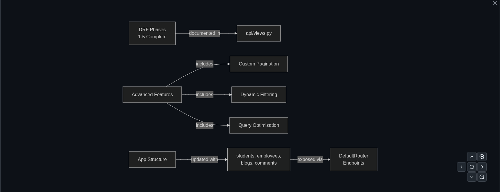

# Django REST Framework (DRF) Architecture Playbook


## Overview
This repository serves as a foundational engineering playbook for building scalable backend APIs with the Django REST Framework. It tracks the architectural evolution of a backend system from basic routing to highly abstracted, production-ready ViewSets. 

This codebase is designed as the underlying data layer template for future Full-Stack applications, including EdTech platforms and Machine Learning integrations.

## System Architecture


## Tech Stack
* **Language:** Python 3.x
* **Framework:** Django 5.2.12
* **API Framework:** Django REST Framework (DRF) 3.16.1
* **Database:** SQLite (Development)

## Architectural Evolution Roadmap
This project deliberately walks through the 5 levels of DRF view abstraction to demonstrate the "why" behind the framework's design patterns. All phases are completed and documented in `api/views.py`:

- [x] **Phase 1: Infrastructure Setup** (Environment config, DRF installation, API client setup)
- [x] **Phase 2: Data Serialization** (Mapping database models to JSON via `ModelSerializer`)
- [x] **Phase 3.1: Function-Based Views (FBVs)** (Explicit HTTP verb routing using `@api_view`)
- [x] **Phase 3.2: Class-Based Views (CBVs)** (Object-oriented method routing via `APIView`)
- [x] **Phase 3.3: Mixins** (Applying DRY principles with pre-built CRUD operations)
- [x] **Phase 3.4: Generics** (`GenericAPIView` for rapid standard endpoint generation)
- [x] **Phase 3.5: ViewSets & Routers** (Automated URL wiring and comprehensive database logic via `ModelViewSet`)

## Advanced Implementations
Beyond standard CRUD, this repository implements production-level API features:
* **Custom Pagination:** Implemented `CustomPageNumberPagination` to standardize API response payloads with next/previous links and total counts.
* **Dynamic Filtering & Searching:** Utilized `django_filters` alongside DRF's `SearchFilter` and `OrderingFilter` for robust endpoint querying (e.g., filtering employees by designation).
* **Query Optimization:** Implemented `prefetch_related` on nested serializers (Blogs & Comments) to prevent N+1 query performance bottlenecks.

## Testing & Validation
All API endpoints, including nested relationships, pagination loops, and dynamic filtering parameters, have been rigorously tested and validated using **Postman** to ensure accurate HTTP status codes and JSON payload structures.

## Local Setup & Installation

**1. Clone the repository**
```bash
git clone [https://github.com/ft-mammoo/DRF-API-Development.git](https://github.com/ft-mammoo/DRF-API-Development.git)
cd DRF-API-Development
```

**2. Create and activate a virtual environment**
```bash
# Windows
python -m venv venv
venv\Scripts\activate

# macOS/Linux
python3 -m venv venv
source venv/bin/activate
```

**3. Install dependencies**
```bash
pip install -r requirements.txt
```

**4. Apply database migrations**
```bash
python manage.py makemigrations
python manage.py migrate
```

**5. Run the development server**
```bash
python manage.py runserver
```

## Application Structure
* `drf_api_dev/`: The core project configuration folder containing main URL routing and settings.
* `api/`: The dedicated DRF application layer. Contains the centralized ViewSets, custom pagination rules, filtering logic, and API router configurations.
* `students/`: Foundation app demonstrating baseline model serialization.
* `employees/`: Demonstrates advanced filtering, searching, and ordering using `django-filters`.
* `blogs/`: Demonstrates one-to-many database relationships (Blogs to Comments) and nested serializers.

## API Endpoints (Development)
**Base URL:** `http://127.0.0.1:8000/api/v1/`

All endpoints below are handled automatically via DRF `DefaultRouter` and support standard `GET`, `POST`, `PUT`, `PATCH`, and `DELETE` methods.

* `/students/` - Manage student records.
* `/employees/` - Manage employee records (Supports `?search=`, `?ordering=`, and custom filters).
* `/blogs/` - Manage blog posts (Returns nested comment data).
* `/comments/` - Manage individual blog comments.